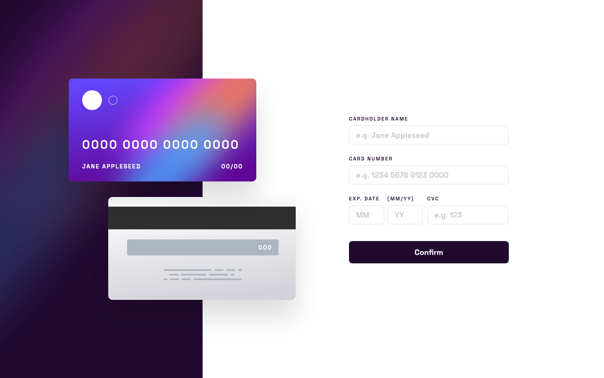

# Interactive card details form solution

This is a solution to the [Interactive card details form challenge on Frontend Mentor](https://www.frontendmentor.io/challenges/interactive-card-details-form-XpS8cKZDWw). Frontend Mentor challenges help you improve your coding skills by building realistic projects.

This challenge was crafted using vanilla HTML, CSS, and JavaScript, focusing on form validation with a responsive design that adapts to any screen size.

## View it live

| [Live Demo URL](https://ionstici.github.io/interactive-card-details-form) | [Frontend Mentor](https://www.frontendmentor.io/solutions/interactive-card-details-form-XSJcxZvsaK) |
| ------------------------------------------------------------------------- | --------------------------------------------------------------------------------------------------- |

## Features

- **Form Validation:** Ensures cardholder name, card number, expiration date, and CVC are correctly formatted and filled.
- **Input Feedback:** Provides visual feedback for form input errors, enhancing user experience.
- **Responsive Design:** Looks and functions perfectly on desktops, tablets, and mobiles.
- **Interactive Card Display:** As users input their card details, the card on the left updates at submit time, providing a dynamic interaction.

## Built with

- HTML5 for structuring the context
- CSS for styling and creating a appealing layout
- Mobile-first workflow
- JavaScript for form validation

## Screenshot

## Acknowledgments

[Frontend Mentor](http://frontendmentor.io) provides real-world web projects ideas and helps hone your frontend coding skills.

<!-- ### Primary

- Linear gradient (active input border): hsl(249, 99%, 64%) to hsl(278, 94%, 30%)
- Red (input errors): hsl(0, 100%, 66%)

### Neutral

- White: hsl(0, 0%, 100%)
- Light grayish violet: hsl(270, 3%, 87%)
- Dark grayish violet: hsl(279, 6%, 55%)
- Very dark violet: hsl(278, 68%, 11%)

### Body Copy

- Font size: 18px

### Font

- Family: [Space Grotesk](https://fonts.google.com/specimen/Space+Grotesk)
- Weights: 500 -->
